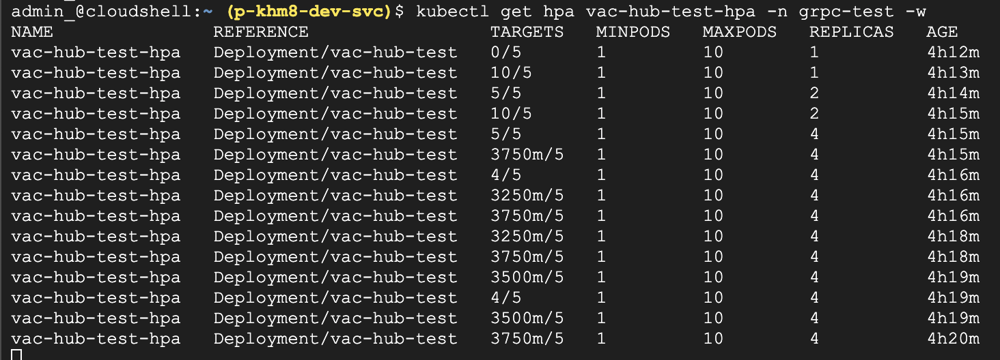

# GKE Autopilot gRPC 서버의 커스텀 메트릭 기반 HPA 구축 가이드

이 가이드는 GKE Autopilot 클러스터에 배포된 gRPC 서버의 부하에 따라 Horizontal Pod Autoscaler(HPA)가 동작하도록 구성하는 전체 과정을 안내합니다. OpenTelemetry와 Prometheus를 사용하지만, 최종적으로는 **애플리케이션이 직접 HPA를 위한 커스텀 메트릭(`Gauge`)을 노출**하는 가장 안정적이고 간단한 방식을 사용합니다.

### **전체 아키텍처 및 시나리오 요약**

1.  **GKE Autopilot 클러스터 생성:** Managed Service for Prometheus(GMP)가 활성화된 클러스터를 준비합니다.
2.  **gRPC 서버 개발:** OpenTelemetry 외에, HPA가 사용할 **`grpc_server_active_streams`** 라는 `Gauge` 타입의 커스텀 메트릭을 직접 생성하여 노출합니다. 이 메트릭은 현재 처리 중인 동시 요청 수를 나타냅니다.
3.  **컨테이너화 및 배포:** gRPC 서버를 컨테이너 이미지로 빌드하고 GKE에 배포합니다.
4.  **GMP 설정:** `PodMonitoring` 리소스를 배포하여 GKE의 관리형 Prometheus가 우리 서버의 메트릭 엔드포인트를 수집하도록 설정합니다.
5.  **HPA 및 Gateway 배포:** 생성된 커스텀 메트릭을 기반으로 동작하는 `HPA`와, 외부 트래픽을 위한 GCLB를 생성하는 `Gateway` 및 `HTTPRoute`를 배포합니다.
6.  **테스트 실행 및 검증:** gRPC 클라이언트로 부하를 발생시키고, HPA가 `grpc_server_active_streams` 메트릭을 기반으로 파드 수를 성공적으로 스케일링하는지 확인합니다.

### **제약 사항**

1.  **gRPC long-lived connection**: gRPC 스트림은 한 번 맺어진 TCP 연결 위에서 계속 통신하므로, HPA가 활성화되어 새로운 Pod가 추가되더라도 기존 연결들은 끊어지지 않고 계속 첫 번째 Pod에만 머무르게 됩니다. 새로운 Pod들은 클라이언트가 새로운 연결을 만들지 않는 한 아무런 트래픽도 받지 못하고 유휴 상태로 남게 됩니다. 이 가이드에서는 서버가 일정 시간 유지된 연결(grpc.max_connection_age)에 대해 클라이언트에 종료 신호(GOAWAY)를 보내면 클라이언트는 유예 시간(grpc.max_connection_age_grace) 동안 진행 중인 스트림을 완료한 후 다시 재연결하도록 구성했습니다.  (참조문서: https://github.com/grpc/proposal/blob/master/A9-server-side-conn-mgt.md) 

2.  **Google Managed Prometheus(GMP)**: GMP를 통해 Prometheus 형식으로 내보낸 커스텀 사용자 정의 측정 항목을 기준으로 HPA를 구성하려면 Promethus 측정 항목은 **Guage 유형**이어야 합니다. (참조문서: https://cloud.google.com/kubernetes-engine/docs/tutorials/autoscaling-metrics?hl=ko#custom-metric) (하지만, 테스트 해본 결과는 **Counter 유형**도 가능합니다.) 자동으로 생성되는 gRPC OpenTelemetry 서버 메트릭은 대부분 **Histogram 유형**이라서 HPA Custom Metric으로 사용이 불가합니다. 본 가이드에서는 서버로 들어오는 gRPC 활성 스트림 개수를 측정하는 Guage 유형의 Custom metric을 생성하여 사용합니다.  
---

### **Phase 1: GKE 클러스터 및 환경 준비**

1.  **gcloud 프로젝트 설정:**
    ```bash
    # (이미 설정하셨다면 생략)
    gcloud auth login 
    gcloud config set project [YOUR_PROJECT_ID]
    gcloud config set compute/region [YOUR_REGION] #asia-northeast3
    ```

2.  **환경 변수 설정 및 확인:**
    ```bash
    export PROJECT_ID=$(gcloud config list --format 'value(core.project)')
    export REGION=$(gcloud config list --format 'value(compute.region)')
    export CLUSTER_NAME=[YOUR_CLUSTER_NAME] # grpc-otel-test

    echo $PROJECT_ID
    echo $REGION
    echo $CLUSTER_NAME
    ```

3.  **필수 API 활성화:**
    ```bash
    gcloud services enable \
        container.googleapis.com \
        monitoring.googleapis.com \
        artifactregistry.googleapis.com \
        cloudbuild.googleapis.com \
        --project=$PROJECT_ID
    ```

4.  **GKE Autopilot 클러스터 생성:**
    *   `--enable-managed-prometheus` 플래그는 Autopilot에서 기본값이므로 생략 가능합니다.
    ```bash
    gcloud container clusters create-auto $CLUSTER_NAME \
        --release-channel=regular \
        --location=$REGION
    ```

5.  **Gateway API 기능 활성화:**
    *   GKE Gateway Controller가 Google Cloud Load Balancer를 프로비저닝하는 데 필요합니다.
    ```bash
    gcloud container clusters update $CLUSTER_NAME \
        --location=$REGION \
        --gateway-api=standard
    ```

6.  **클러스터 인증 정보 가져오기 및 GKE Cluster 정보 확인:**
    ```bash
    gcloud container clusters get-credentials $CLUSTER_NAME --location $REGION
    kubectl config current-context
    ```

7.  **테스트용 TLS 인증서 생성:**
    ```bash
    # k8s 디렉토리로 이동
    cd ~/grpc-hpa-test/k8s
    
    # 자체 서명 인증서와 키 생성
    openssl req -x509 -newkey rsa:2048 -nodes -keyout tls.key -out tls.crt -subj "/CN=grpc.example.com"
    ``` 
---

### **Phase 2: 서버 컨테이너화**

1.  **Artifact Registry 저장소 생성 (필요시):**
    ```bash
    gcloud artifacts repositories create grpc-test-repo \
        --repository-format=docker \
        --location=$REGION
    ```

2.  **Cloud Build로 이미지 빌드 및 푸시:**
    ```bash
    cd ~/grpc-hpa-test

    export IMAGE_TAG=$(date -u +%Y%m%d-%H%M%S)
    echo "New image tag: $IMAGE_TAG"
    
    gcloud builds submit ./server --tag="${REGION}-docker.pkg.dev/${PROJECT_ID}/grpc-test-repo/vac-hub-test:${IMAGE_TAG}"
    ```
---

### **Phase 3: Custom Metrics Stackdriver Adapter 설치**

Google Cloud Monitoring에서 수집한 Custom Metric을 HPA로 전달하기 위한 **Custom Metrics Stackdriver Adaper**를 클러스터에 배포합니다. 

1.  **Custom Metrics Stackdriver Adaper 배포:**
    ```bash
    kubectl apply -f https://raw.githubusercontent.com/GoogleCloudPlatform/k8s-stackdriver/master/custom-metrics-stackdriver-adapter/deploy/production/adapter_new_resource_model.yaml
    ```

2.  **Adaper Pod 정상 동작 확인:**
    ```bash
    kubectl get pods -n custom-metrics
    ```

3.  **Custom Metrics API 등록 여부 확인:**
    ```bash
    kubectl get apiservices | grep custom.metrics.k8s.io
    ```
---

### **Phase 4: GKE 배포**

이제 필요한 모든 쿠버네티스 리소스를 배포합니다.

1.  **Namespace 및 TLS Secret 생성:**
    ```bash
    cd ~/grpc-hpa-test/k8s
    kubectl apply -f ./namespace.yaml
    kubectl create secret tls grpc-cert -n grpc-test --key tls.key --cert tls.crt --dry-run=client -o yaml | kubectl apply -f -
    ```

2.  **GMP(Managed Prometheus) 설정** 
    `PodMonitoring` 리소스를 생성하여 GMP가 애플리케이션의 `/metrics` 엔드포인트를 주기적으로 수집(scrape)하도록 지시합니다.
    ```bash
    cd ~/grpc-hpa-test/k8s
    kubectl apply -f ./pod-monitoring.yaml
    ```

3.  **Gateway 및 HTTPRoute 생성 (GCLB용):**
    ```bash
    cd ~/grpc-hpa-test/k8s
    kubectl apply -f ./gateway.yaml
    ```

4.  **Deployment 및 Service 생성:**
    ```bash
    cd ~/grpc-hpa-test/k8s
    # deployment.yaml의 이미지 태그를 최신 버전으로 바꿉니다.
    envsubst < deployment.yaml | kubectl apply -f -
    kubectl apply -f ./service.yaml
    ```

5.  **HPA 생성:**
    `hpa.yaml` 파일이 커스텀 메트릭 `grpc_server_active_streams`를 바라보도록 설정합니다.
    ```bash
    cd ~/grpc-hpa-test/k8s
    kubectl apply -f ./hpa.yaml
    ```
---

### **Phase 5: 테스트 실행 및 결과 검증**

1.  **배포 상태 확인:**
    ```bash
    # Secret 확인
    kubectl get secret grpc-cert -n grpc-test

    # Deployment와 Service가 정상적으로 생성되었는지 확인
    kubectl get deployment,svc -n grpc-test

    # Pod 상태 확인
    kubectl get pods -n grpc-test
    ```
    

2.  **Gateway Backend Protocol 및 외부 IP 확인:**
    *   Cloud Load Balancer backend protocol 확인
    ```bash
    gcloud compute backend-services list \
        --filter="name~grpc-test AND name~vac-hub-test-svc" \
        --format="value(name)" \
    | xargs -I {} gcloud compute backend-services describe {} --global --format="value(protocol)"
    ```
    

    *   GCLB가 프로비저닝되고 IP가 할당되기까지 몇 분 정도 소요됩니다.
    ```bash
    kubectl get gateway vac-hub-gateway -n grpc-test -w
    ```
    `ADDRESS` 필드에 나타나는 IP 주소를 복사합니다.

    

3.  **클라이언트 실행:**
    ```bash
    # 1. 서버 인증서 파일을 클라이언트 디렉토리로 복사
    cp ~/grpc-hpa-test/k8s/tls.crt ~/grpc-hpa-test/client/
    
    # 2. 가상환경 활성화 및 client 디렉토리로 이동
    cd ~/grpc-hpa-test
    source venv/bin/activate
    cd ~/grpc-hpa-test/client
    
    # 3. 클라이언트 실행 (스트림 수를 늘려 부하를 발생시킵니다)
    python client.py [GATEWAY_EXTERNAL_IP]:443 --streams 15 --cert_file ./tls.crt
    ```
    

4.  **서버 POD 동작 확인:**
    *   새 터미널을 열고 첫번째 서버 POD의 변화를 실시간으로 확인합니다.
    ```bash
    kubectl get pods -n grpc-test
    kubectl logs -n grpc-test -f [FIRST_SERVER_POD_NAME]
    ```
    *  Client Stream이 10개까지 증가한 후 Stream 연결 시간 및 Grace Time이 지난 후 부터 grpc 부하가 줄어드는 것을 확인할 수 있습니다.
    
    * GKE 콘솔의 워크로드 탭에서 vac-hub-test를 선택해서 확인하면 Client Stream이 유입된 후 HPA에 의해 POD 수평 확장이 일어났으나, 첫번째 POD에만 Connection이 연결되어 첫번째 POD는 비정상 작동하는 것을 확인할 수 있습니다. 이후 Connection이 POD들에 재분배되어 정상 작동하는 것을 확인할 수 있습니다. 
    

    

5.  **HPA 동작 확인:**
    *   새 터미널을 열고 HPA의 변화를 실시간으로 확인합니다.
    ```bash
    
    kubectl get hpa vac-hub-test-hpa -n grpc-test -w
    ```
    *   `TARGETS` 컬럼에 `현재 값 / 목표 값` (예: `8/5`)이 표시됩니다. 현재 값이 목표 값을 초과하면 `REPLICAS` 수가 1에서 점차 늘어나는 것을 볼 수 있습니다.
    

6.  **Cloud Monitoring에서 메트릭 확인:**
    *   Google Cloud Console에서 **Monitoring > Metrics Explorer**로 이동합니다.
    *   **PROMQL** 탭을 선택하고 다음 쿼리를 입력합니다.
        ```promql
        grpc_server_active_streams{namespace="grpc-test"}
        ```
    *   그래프에 HPA에 의해 파드가 늘어나는 모습이 시각적으로 나타납니다.
    

    *   **빌더** 탭을 선택하고 측정항목 선택을 클릭한 후 **Prometheus Target** > **Grpc** 항목 밑에 있는 Grpc 메트릭들을 선택해서 확인합니다. Opentelemetry에 의해 수집된 gRPC Server Metric을 확인할 수 있습니다.
    

    

    *   **빌더** 탭을 선택하고 측정항목 선택을 클릭한 후 **Prometheus Target** > **App** > **app_message_processed_count_total**을 선택 한 후 확인합니다. Server App에서 넣었던 Custom Metric을 확인할 수 있습니다.
    
    
    

7.  **테스트 종료 후 정리:**
    ```bash
    # Namespace 전체를 삭제하여 모든 리소스를 정리합니다.
    kubectl delete ns grpc-test

    # GKE 클러스터 삭제 (선택 사항)
    # gcloud container clusters delete $CLUSTER_NAME --location=$REGION
    ```